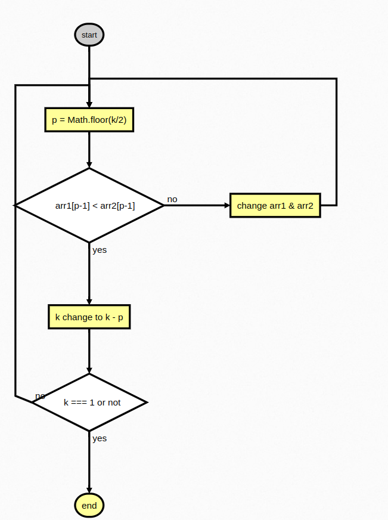
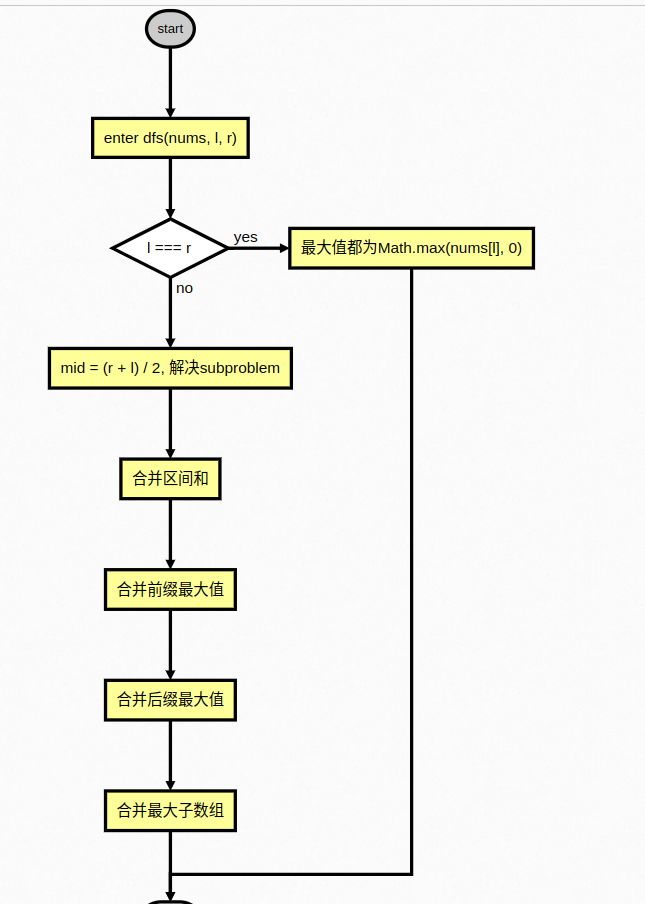

# Lab1

- SA23225077
- 李嘉骏

## Pro1: Median of Two Sorted Arrays

### 代码

```javascript
var findMedianSortedArrays = function (nums1, nums2) {
  let len1 = nums1.length;
  let len2 = nums2.length;
  let left = Math.floor((len1 + len2 + 1) / 2);
  let right = Math.floor((len1 + len2 + 2) / 2);
  return (
    (findkth(nums1, 0, len1 - 1, nums2, 0, len2 - 1, left) +
      findkth(nums1, 0, len1 - 1, nums2, 0, len2 - 1, right)) /
    2
  );
};
function findkth(arr1, start1, end1, arr2, start2, end2, k) {
  let n = end1 - start1 + 1;
  let m = end2 - start2 + 1;
  if (n > m) return findkth(arr2, start2, end2, arr1, start1, end1, k);
  if (n === 0) return arr2[start2 + k - 1];
  if (k === 1) return Math.min(arr1[start1], arr2[start2]);
  let i = start1 + Math.min(n, Math.floor(k / 2)) - 1;
  let j = start2 + Math.min(m, Math.floor(k / 2)) - 1;
  if (arr1[i] > arr2[j]) {
    return findkth(arr1, start1, end1, arr2, j + 1, end2, k - (j - start2 + 1));
  } else {
    return findkth(arr1, i + 1, end1, arr2, start2, end2, k - (i - start1 + 1));
  }
}
```

### 思路

- 流程图(by flowchart.js)
  
- 算法思路解释

本题可以将找中位数转化成找有序数组第 i 小和第 j 小的数字.
设 p = Math.floor(k / 2):
在两个正序数组中找第 k 小的数字步骤为首先比较 arr1[p - 1]和 arr2[p - 1],假设前者小,因为两个数组都是正序，所以 arr1 中下标在[0, p - 1]范围的都不可能是第 k 小的数，可以排除，arr1 剩下下标[p, arr1.length - 1].步骤 2 的[0, p - 1]范围都是比第 k 小的数字还要小的数字，所以只要在剩下两个数组中找到第 k - (p - 1 - 0 + 1)小的数字,新一轮的 k = k - (p - 1 - 0 + 1).重复上面的步骤，直到 k === 1，这时候比较两个剩下的数组中第一个数字大小，取最小的就是结果.

### 结果


## Pro2: Maximum Subarray

```Typescript
// Typescript version
function maxSubArray(nums: number[]): number {
    const dfs = function (l: number, r: number): number[] {
        if (l == r) {
            const t = Math.max(nums[l], 0);
            return [nums[l], t, t, t];
        }
        const mid = (l + r) >> 1;
        const left = dfs(l, mid), right = dfs(mid + 1, r);
        const ans = Array(4).fill(0);
        ans[0] = left[0] + right[0];
        ans[1] = Math.max(left[1], left[0] + right[1]);
        ans[2] = Math.max(right[2], right[0] + left[2]);
        ans[3] = Math.max(left[3], right[3], left[2] + right[1]);
        return ans;
    }

    const m = Math.max(...nums);
    if (m <= 0) return m;
    return dfs(0, nums.length - 1)[3];
};

```

### 算法思路

- 流程图(by flowchart.js)
  
- 时间复杂度
  假设我们把递归的过程看作是一颗二叉树的先序遍历，那么这颗二叉树的深度的渐进上界为 O(log⁡n).总时间复杂度近似遍历二叉树的时间复杂度为 O(n)

### 结果


