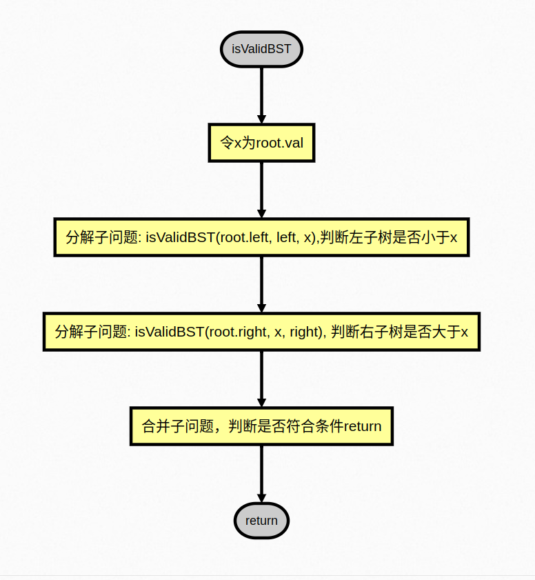
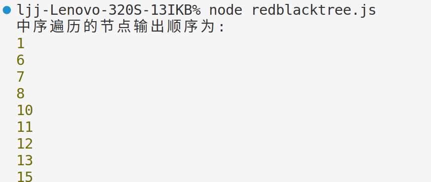

# Lab3

- SA23225077
- 李嘉骏

## isValidBST

### 代码

```javascript
// 判断一颗树是否为二叉查找树
var isValidBST = function (
  root,
  left = Number.MIN_SAFE_INTEGER,
  right = Number.MAX_SAFE_INTEGER
) {
  if (root == null) return true;
  const x = root.val;
  return (
    left < x &&
    x < right &&
    isValidBST(root.left, left, x) &&
    isValidBST(root.right, x, right)
  );
};
```

### 算法流程



### 结果

在 leetcode 平台进行测试


## red black tree

```javascript
// javascript version

const RedBlackTreeNode = require('./RedBlackTreeNode');
const BLACK = 1;
const RED = 0;

class RedBlackTree {
  constructor() {
    this.root = null;
  }

  /**
   *
   * @param {number} val
   * @param {RedBlackTreeNode} node
   * @return {RedBlackTreeNode}
   */
```

- 插入操作

```javascript
// 插入操作
  _insert(val) {
    let t = this.root;
    let p = null;
    while (t) {
      p = t;
      if (t.val < val) {
        t = t.right;
      } else if (t.val > val) {
        t = t.left;
      } else return;
    }
    let node = new RedBlackTreeNode(val);
    node.parent = p;
    if (p === null) {
      this.root = node;
    } else if (p.val < node.val) {
      p.right = node;
    } else {
      p.left = node;
    }
    node.color = RED;
    this.insertFix(node);
  }

```

- 删除操作

```javascript
  /**
   *
   * @param {RedBlackTreeNode} node
   * @param {number} val
   * @return {boolean}
   */
  _remove(node, val) {
    while (node.val !== val && node) {
      if (node.val > val) {
        node = node.left
      } else {
        node = node.right
      }
    }
    if (node) {
      if (!node.left || !node.right) {
        this._removeAndFix(node);
      } else {
        let minNode = this.findMin(node.right);
        node.val = minNode.val;
        this._remove(node.right, minNode.val);
      }
    } else return false;
    return true
  }

  /**
   * @param {RedBlackTreeNode} node
   */
  _removeAndFix(node) {
    if (node.color === RED) {
      this._removeNode(node);
    } else {
      this._removeFix(node);
    }
  }

  /**
   *
   * @param {RedBlackTreeNode} node
   */
  _removeNode(node) {
    if (node === this.root) {
      if (node.left) {
        this.root = node.left;
        node.parent = null;
      } else if (node.right) {
        this.root = node.right;
        node.parent = null;
      } else {
        this.root = null;
      }
    } else {
      if (node.parent.left === node) {
        if (node.left) {
          node.parent.left = node.left;
          node.left.parent = node.parent;
        } else if (node.right) {
          node.parent.left = node.right;
          node.right.parent = node.parent
        } else {
          node.parent.left = null
        }
      } else {
        if (node.left) {
          node.parent.right = node.left;
          node.left.parent = node.parent;
        } else if (node.right) {
          node.parent.right = node.right;
          node.right.parent = node.parent
        } else {
          node.parent.right = null
        }
      }
    }
  }
```

- 删除后修复

```javascript
  /**
   *
   * @param {RedBlackTreeNode} node                                              */
  _removeFix(node) {
    let nodeRef = node;
    while (node !== this.root && node.color === BLACK) {
      if (node.parent.left === node) {
        let brotherNode = node.parent.right;
        if (brotherNode.color === RED) {
          brotherNode.color = BLACK;
          node.color = BLACK;
          node.parent.color = RED;
          this._rotateLeft(node.parent);
        } else if (
          (!brotherNode.left || brotherNode.left.color === BLACK)
          &&
          (!brotherNode.right || brotherNode.right.color === BLACK)
        ) {
          if (node.parent.color === RED) {
            brotherNode.color = RED;
            node.parent.color = BLACK;
            node = this.root;
          } else {
            brotherNode.color = RED;
            node = node.parent;
          }
        } else if (brotherNode.left.color === RED && brotherNode.right.color === BLACK) {
          this._rotateRight(brotherNode);
          brotherNode.color = RED;
          brotherNode.parent.color = BLACK;
        } else if (brotherNode.right.color === RED) {
          brotherNode.color = node.parent.color;
          node.parent.color = BLACK;
          brotherNode.right.color = BLACK;
          this._rotateLeft(node.parent);
          node = this.root;
        }
      } else {
        let brotherNode = node.parent.left;
        if (brotherNode.color === RED) {
          brotherNode.color = BLACK;
          node.color = BLACK;
          node.parent.color = RED;
          this._rotateRight(node.parent);
        } else if (
          (!brotherNode.left || brotherNode.left.color === BLACK)
          &&
          (!brotherNode.right || brotherNode.right.color === BLACK)
        ) {
          if (node.parent.color === RED) {
            brotherNode.color = RED;
            node.parent.color = BLACK;
            node = this.root;
          } else {
            brotherNode.color = RED;
            node = node.parent;
          }
        } else if (brotherNode.right.color === RED && brotherNode.left.color === BLACK) {
          this._rotateLeft(brotherNode);
          brotherNode.color = RED;
          brotherNode.parent.color = BLACK;
        } else if (brotherNode.left.color === RED) {
          brotherNode.color = node.parent.color;
          node.parent.color = BLACK;
          brotherNode.left.color = BLACK;
          this._rotateRight(node.parent);
          node = this.root;
        }
      }
    }
    node.color = BLACK;
    this._removeNode(nodeRef);
  }

```

- 插入后修复

```javascript
  /**
   *
   * @param {RedBlackTreeNode} node
   */
  insertFix(node) {
    while (node.parent && node.parent.color !== BLACK) {
      if (node.parent === node.parent.parent.left) {
        let uncleNode = node.parent.parent.right;
        if (uncleNode && uncleNode.color === RED) {
          node.parent.color = BLACK;
          uncleNode.color = BLACK;
          node.parent.parent.color = RED;
          node = node.parent.parent;
        } else if (node === node.parent.right) {
          node = node.parent;
          this._rotateLeft(node);
        } else {
          node.parent.color = BLACK;
          node.parent.parent.color = RED;
          this._rotateRight(node.parent.parent);
        }
      } else {
        let uncleNode = node.parent.parent.left;
        if (uncleNode && uncleNode.color === RED) {
          node.parent.color = BLACK;
          uncleNode.color = BLACK;
          node.parent.parent.color = RED;
          node = node.parent.parent;
        } else if (node === node.parent.left) {
          node = node.parent;
          this._rotateRight(node);
        } else {
          node.parent.color = BLACK;
          node.parent.parent.color = RED;
          this._rotateLeft(node.parent.parent);
        }
      }
    }
    this.root.color = BLACK;
  }

```

- 左旋

```javascript
  /**
   *
   * @param {RedBlackTreeNode} node
   * @return {RedBlackTreeNode}
   */
  _rotateLeft(node) {
    let rightNode = node.right;
    let rightNodeLeft = rightNode.left;
    node.right = rightNodeLeft;
    if (rightNodeLeft) rightNodeLeft.parent = node;
    rightNode.left = node;
    if (node.parent) {
      if (node.parent.left === node) {
        node.parent.left = rightNode;
      } else {
        node.parent.right = rightNode;
      }
      rightNode.parent = node.parent;
    } else {
      this.root = rightNode;
      rightNode.parent = null;
    }
    node.parent = rightNode;
  }
```

- 右旋

```javascript
  /**
   *
   * @param {RedBlackTreeNode} node
   * @return {RedBlackTreeNode}
   */
  _rotateRight(node) {
    let leftNode = node.left;
    let leftNodeRight = leftNode.right;
    node.left = leftNodeRight;
    if (leftNodeRight) leftNodeRight.parent = node;
    leftNode.right = node;
    if (node.parent) {
      if (node.parent.left === node) {
        node.parent.left = leftNode;
      } else {
        node.parent.right = leftNode;
      }
      leftNode.parent = node.parent;
    } else {
      this.root = leftNode;
      leftNode.parent = null;
    }
    node.parent = leftNode;
  }
```

测试代码

```javascript
const t = new RedBlackTree();
t.insert(1);
t.insert(5);
t.insert(6);
t.insert(7);
t.insert(8);
t.insert(9);
t.insert(10);
t.insert(11);
t.insert(12);
t.insert(13);
t.insert(14);
t.insert(15);

t.remove(14);
t.remove(9);
t.remove(5);

const order = (t) => {
  if (!t) return;
  order(t.left);
  if (t.val) console.log(t.val);
  order(t.right);
  return;
};
console.log("中序遍历的节点输出顺序为:");
order(t.root);
```

实验结果为:

中序遍历的结果符合预期.

### 对比

二叉查找树和红黑树的区别，以及各自时间空间性能如下：

二叉查找树（Binary Search Tree, BST）和红黑树（Red-Black Tree）都是自平衡的二叉查找树，但它们在实现平衡和颜色使用上有所不同，这影响了它们的时间和空间性能。

- 平衡性：

  - 二叉查找树：没有明确的平衡要求。当插入或删除节点时，如果只考虑查找操作，我们不需要担心树的平衡。但若要确保平均时间复杂度为 O(log n)，通常需要维护树的平衡。
  - 红黑树：是一种自平衡的二叉查找树，通过颜色和五个性质来维护平衡。节点分为红色或黑色，并满足以下性质：
    - 每个节点或者是红色，或者是黑色。
    - 根节点是黑色。
    - 每个叶子节点（NIL 或空节点）是黑色。
    - 如果一个节点是红色的，则它的子节点都是黑色的。
    - 从任一节点到其每个叶子的所有路径都包含相同数目的黑色节点。

- 时间复杂度：

  - 二叉查找树：在最坏情况下，可能退化为链表（即退化成 O(n)的查找时间复杂度）。但若维护平衡，查找、插入和删除操作的时间复杂度可以保持在 O(log(n))。
  - 红黑树：在理想情况下，红黑树保持平衡，因此查找、插入和删除操作的时间复杂度为 O(log(n))。

- 空间性能：

  - 二叉查找树：没有使用颜色标记，因此在空间上相对较小。
  - 红黑树：除了存储数据外，还需要存储颜色信息，因此空间上稍微大一些。

- 插入和删除操作：

  - 二叉查找树：插入和删除操作相对简单，但需要额外的逻辑来维护平衡。
  - 红黑树：插入和删除操作更为复杂，因为除了考虑 BST 性质外，还需要考虑红黑树的五个性质。

- 其他操作：
  - 红黑树：除了常见的查找、插入和删除操作外，红黑树还支持其他操作，如旋转、颜色调整等，这使得红黑树在某些应用中更为灵活。
