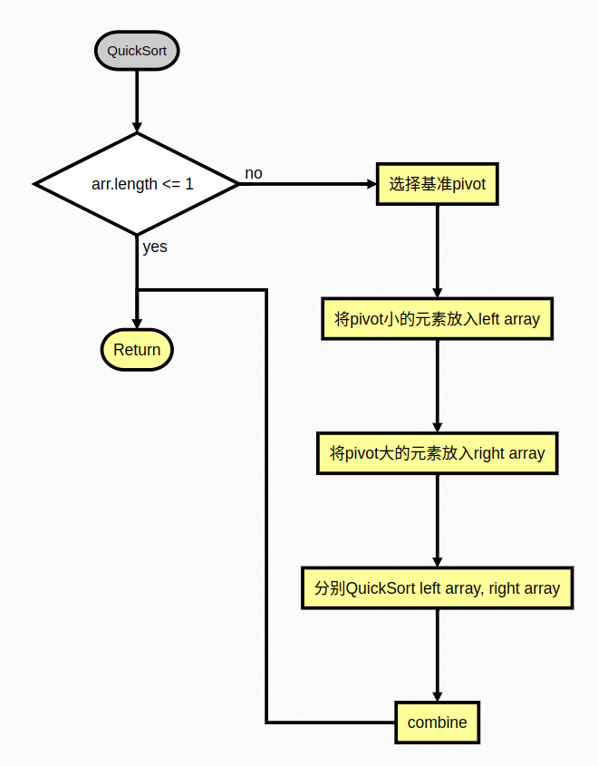
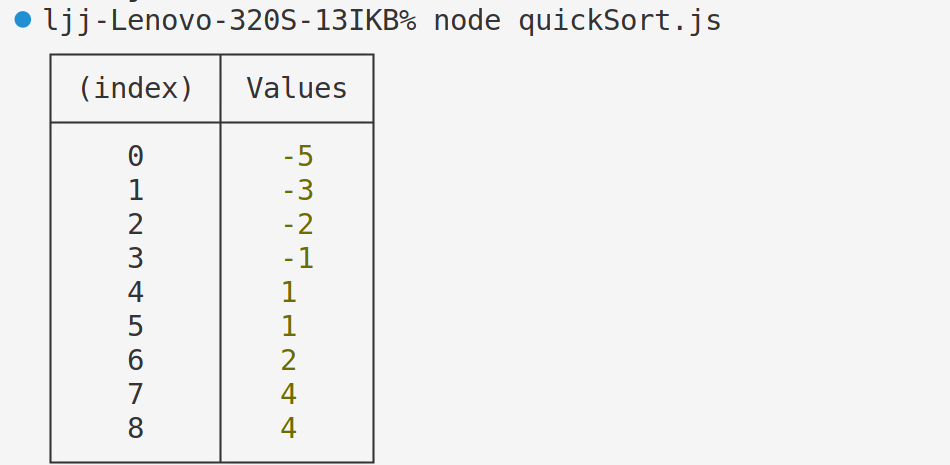
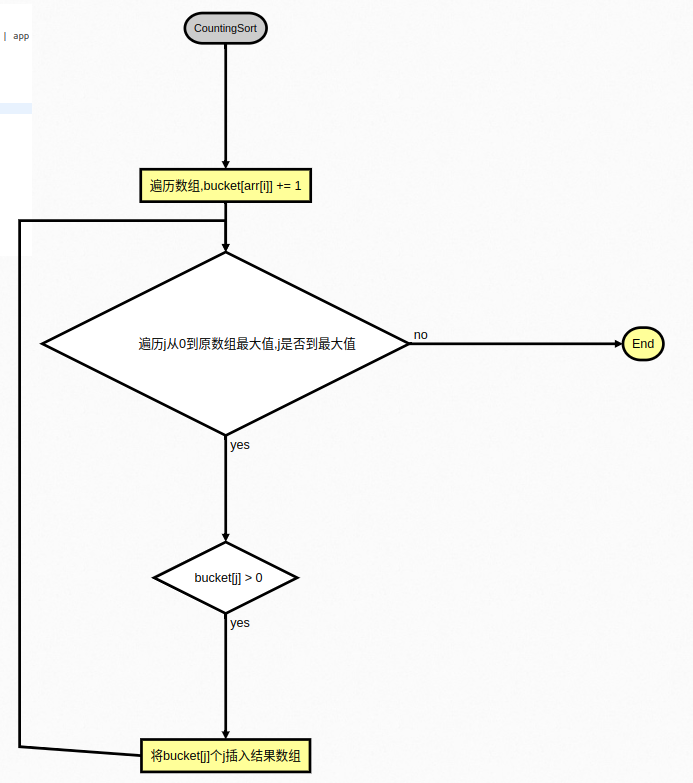
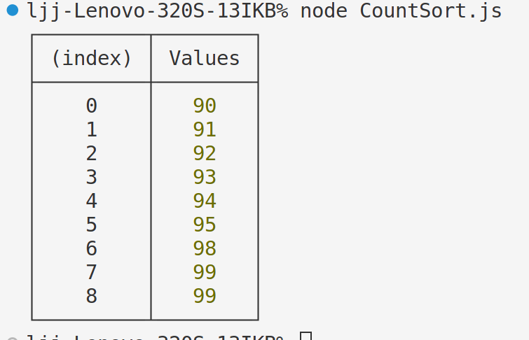

# Lab2

- SA23225077
- 李嘉骏

## Pro1: QuickSort

### 代码

```javascript
// javascript version
// QuickSort by javacsript

const quickSort = (arr) => {
  if (arr.length <= 1) return arr;
  const pivotIndex = Math.floor(arr.length / 2);
  let pivot = arr[pivotIndex];
  let left = [];
  let right = [];
  for (let i = 0; i < arr.length; i++) {
    if (i === pivotIndex) continue;
    if (arr[i] < pivot) left.push(arr[i]);
    else right.push(arr[i]);
  }
  if (!left || !right) return left.concat([pivot], right);
  return quickSort(left).concat([pivot], quickSort(right));
};
// 测试数组
const arr1 = [-2, 1, -3, 4, -1, 2, 1, -5, 4];

const rst = quickSort(arr1);
// console.table相比console.log更为直观
console.table(rst);
```

### 思路

- 流程图(by flowchart.js)
  算法通用流程如下:
  

```flowchart.js指令
st=>start: QuickSort | past
e1=>end: Return
op1=>condition: arr.length <= 1 | app
op2=>operation: 选择基准pivot
op3=>operation: 将pivot小的元素放入left array
op4=>operation: 将pivot大的元素放入right array
op5=>operation: 分别QuickSort left array, right array
op6=>operation: combine

st->op1
op1(true)->e1
op1(false)->op2->op3->op4->op5->op6(left)->e1
```

- 算法流程
  针对该测试用例,算法:

1. 第一轮选择-1 作为 pivot,得到左数组为-2, -3, -5
   右数组为 1, 4, 2, 1, 4
2. 第二轮分别选择-3 和 2 作为 pivot, 选择-3 作为 pivot, 左子数组为-5, 右子数组为-2,合并得到-5, -3, -2.而选择 2 作为 pivot, 得到左子数组为 1, 1, 右子数组为 4, 4.
3. 虽然在这一轮结束之后数组已经有序,但仍需进行第三轮操作,如第二轮般操作,最后合并左右子数组,得到正确的最终排序正确的数组.

### 结果



## Pro2: CountingSort

### 代码

```javascript
// Javascript version
function countingSort(arr, maxValue) {
  var bucket = new Array(maxValue + 1),
    sortedIndex = 0;
  (arrLen = arr.length), (bucketLen = maxValue + 1);

  for (var i = 0; i < arrLen; i++) {
    if (!bucket[arr[i]]) {
      bucket[arr[i]] = 0;
    }
    bucket[arr[i]]++;
  }

  for (var j = 0; j < bucketLen; j++) {
    while (bucket[j] > 0) {
      arr[sortedIndex++] = j;
      bucket[j]--;
    }
  }
  return arr;
}
// 测试代码
const arr = [95, 94, 98, 99, 90, 99, 93, 91, 92];
const rst = countingSort(arr, 99);
console.table(rst);
```

### 算法思路

- 流程图(by flowchart.js)
  
- 算法流程
  针对该例, 先将 bucket 对应下标为 95, 94, 91, 98, 99, 90, 99, 93, 91, 92 的值依次加 1,然后从 0 枚举到最大值,判断 bucket 该下标是否有值,如果有,则一直将对应的下标加到结果中,这里依次将 90,91,92,93,94,95,96,97.98,99,99 加入到结果数组中.

### 结果



### 快速排序和计数排序算法比较

快速排序和计数排序的主要区别体现在以下几个方面：

- 稳定性：
  快速排序是一种不稳定的排序算法，即具有相同值的元素在排序后可能会改变其原始相对顺序。相比之下，计数排序是一种稳定的排序算法，能够保持相同值元素之间的原始相对顺序。
- 时间复杂度：
  快速排序的平均时间复杂度为 O(nlogn)，而计数排序的时间复杂度为 O(n)。这意味着在处理大量数据时，计数排序通常比快速排序更快。
- 空间复杂度：
  快速排序的空间复杂度为 O(logn)，而计数排序的空间复杂度为 O(k)，其中 k 为待排序数组中最大值与最小值的差。因此，当 k 值较大时，计数排序可能会消耗更多的内存空间。
- 数据类型：
  快速排序适用于各种数据类型，包括整数、浮点数和字符串等。而计数排序则主要适用于整数或可转换为整数的数据类型，因为它依赖于元素之间的数值差异来确定排序顺序。
- 排序方式：
  快速排序采用分治策略，通过递归地将数组划分为更小的子数组来进行排序。而计数排序则通过统计每个元素的出现次数，并根据这些统计信息来确定元素的最终位置。

总的来说，这两种排序算法各有优缺点，适用于不同的场景和需求。在选择使用哪种算法时，需要根据具体的数据类型、数据量以及对稳定性和性能的要求来进行权衡。
