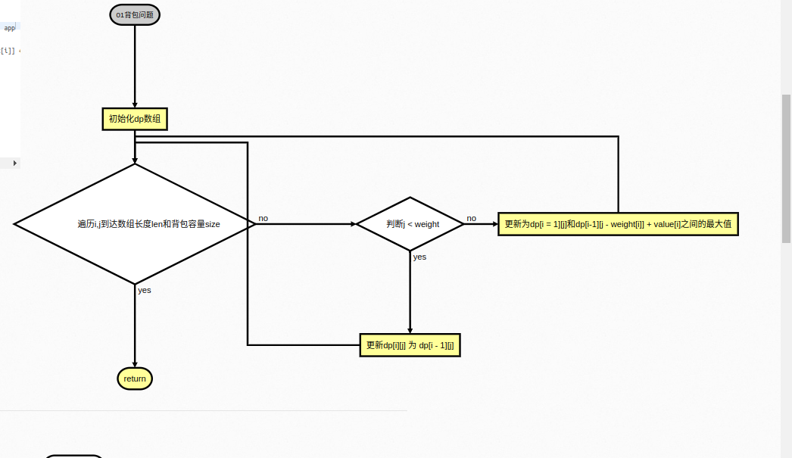

# Lab5

- SA23225077
- 李嘉骏

## solution1: dp

- 方法一：动态规划

```javascript
// javascript 01背包
const WeightBagProblem = (weight, value, size) => {
  // 定义 dp 数组
  const len = weight.length,
    dp = Array(len)
      .fill()
      .map(() => Array(size + 1).fill(0));

  // 初始化
  for (let j = weight[0]; j <= size; j++) {
    dp[0][j] = value[0];
  }

  // weight 数组的长度len 就是物品个数
  for (let i = 1; i < len; i++) {
    // 遍历物品
    for (let j = 0; j <= size; j++) {
      // 遍历背包容量
      if (j < weight[i]) dp[i][j] = dp[i - 1][j];
      else
        dp[i][j] = Math.max(dp[i - 1][j], dp[i - 1][j - weight[i]] + value[i]);
    }
  }

  console.table(dp);

  return dp[len - 1][size];
};

function test() {
  console.log(WeightBagProblem([1, 3, 4, 5], [15, 20, 30, 55], 6));
}

test();
```

### 算法流程

- 算法原理

01 背包问题是：解决有 n 件物品和一个最多能背重量为 w 的背包。第 i 件物品的重量是 weight[i]，得到的价值是 value[i] 。每件物品只能用一次，求解将哪些物品装入背包里物品价值总和最大。
动态规划方法使用的 dp[i][j]的含义：从下标为[0-i]的物品里任意取，放进容量为 j 的背包，价值总和最大是多少。
那么可以有两个方向推出来 dp[i][j]: 1.不放物品 i：由 dp[i - 1][j]推出，即背包容量为 j，里面不放物品 i 的最大价值，此时 dp[i][j]就是 dp[i - 1][j]。(其实就是当物品 i 的重量大于背包 j 的重量时，物品 i 无法放进背包中，所以背包内的价值依然和前面相同。) 2.放物品 i：由 dp[i - 1]j - weight[i]]推出，dp[i - 1]j - weight[i]] 为背包容量为 j - weight[i]的时候不放物品 i 的最大价值，那么 dp[i - 1]j - weight[i]] + value[i] （物品 i 的价值），就是背包放物品 i 得到的最大价值.
所以递归公式： dp[i][j] = max(dp[i - 1][j], dp[i - 1]j - weight[i]] + value[i]).

- 流程图
  

### 复杂度分析

- 时间复杂度
  - O(n^2), 原因是有二重循环结构，进行双层遍历（物品数量和背包容量）
- 空间复杂度
  - O(n^2), 需要开辟二维 dp 数组

我们可以看一下通过 console.table 打印的 dp 数组的结构以及结果


## solution2: 回溯

- 方法二：回溯法

```javascript
const WeightBagProblem_2 = (max, n, items) => {
  //存储背包中物品总重量的最大值
  let maxW = 0;
  __f(0, 0, items, n, max);
  return maxW;
  // cw表示当前已经装进去的物品的重量和
  // i表示考察到哪个物品了
  // w背包重量
  // items表示每个物品的重量
  function __f(i, cw, items, n, w) {
    if (cw === w || i === n) {
      // cw === w表示装满了;i === n表示已经考察完所有的物品
      if (cw > maxW) maxW = cw;
      return;
    }
    f(i + 1, cw, items, n, w); // 不装第 i + 1 个物品的情况
    if (cw + items[i] <= w) {
      // 已经超过可以背包承受的重量的时候，就不要再装了
      f(i + 1, cw + items[i], items, n, w); // 装第 i + 1 个物品的情况
    }
  }
};
```

### 算法流程

回溯算法主要先确定解空间的结构，然后使用深度优先搜索，搜索过程中，先判断所搜索的树节点是否包含问题解，如果肯定不包含，则不再搜索以该节点为根的树节点，二向其祖先节点回溯，否则进入该子树，继续深度优先搜索。

### 复杂度分析

- 时间复杂度
  O(2^n). 递归树的调用次数影响该时间复杂度，但一般会进行剪枝
- 空间复杂度
  O(n). n 是物品数量。空间复杂度主要取决于递归调用层数，层数不超过 n，这里也没有使用额外数组存储

### 算法对比

- 由于回溯时间复杂度是指数级，因此我们这里实现的回溯版本在时间复杂度上不比动态规划表现好。如果试图解决这一问题，可以使用记忆化搜索，来减少时间的开销。
