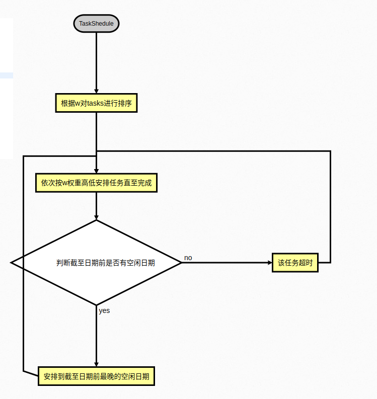
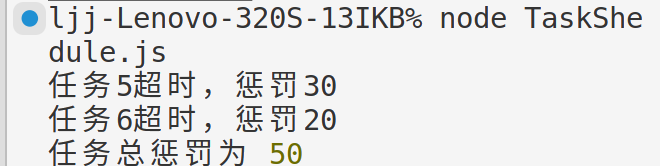
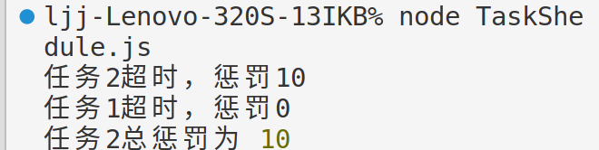

# Lab4

- SA23225077
- 李嘉骏

### 代码

- Wi 替换前实现

```javascript
// 任务调度问题
const TaskShedule = (tasks) => {
  let len = tasks.length;
  tasks.sort((a, b) => b.w - a.w);
  let visitors = new Array(len, false);
  let res = 0;
  for (let i = 0; i < len; i++) {
    let di = tasks[i].d - 1;
    let flag = false;
    if (di >= 0 && !visitors[di]) {
      visitors[di] = true;
      flag = true;
    } else {
      while (di >= 0 && visitors[di]) {
        di -= 1;
        if (di && !visitors[di]) {
          visitors[di] = true;
          flag = true;
          break;
        }
      }
    }
    if (!flag) {
      res += tasks[i].w;
      console.log(`任务${tasks[i].index}超时，惩罚${tasks[i].w}`);
    }
  }
  return res;
};
```

- 测试代码

```javascript
tasks = [
  {
    index: 1,
    d: 4,
    w: 70,
  },
  {
    index: 2,
    d: 2,
    w: 60,
  },
  {
    index: 3,
    d: 4,
    w: 50,
  },
  {
    index: 4,
    d: 3,
    w: 40,
  },
  {
    index: 5,
    d: 1,
    w: 30,
  },
  {
    index: 6,
    d: 4,
    w: 20,
  },
  {
    index: 7,
    d: 6,
    w: 10,
  },
];
console.log("任务总惩罚为", TaskShedule(tasks));
```

- Wi 替换后测试代码

```javascript
task2 = [
  {
    index: 1,
    d: 4,
    w: 0,
  },
  {
    index: 2,
    d: 2,
    w: 10,
  },
  {
    index: 3,
    d: 4,
    w: 20,
  },
  {
    index: 4,
    d: 3,
    w: 30,
  },
  {
    index: 5,
    d: 1,
    w: 40,
  },
  {
    index: 6,
    d: 4,
    w: 50,
  },
  {
    index: 7,
    d: 6,
    w: 60,
  },
];
console.log("更改W后总惩罚为", TaskShedule(task2));
```

### 算法思路

- 算法流程
  
- 算法思路
  将任务根据 w 惩罚权重进行排序，根据权重高低遍历任务，优先将该任务安排在截至日期，若截至 d 已经安排任务，则安排在日期前没有安排任务的一天，最终安排完整个任务。
- 算法复杂度分析
  - 该算法排序部分时间复杂度为 O(nlogn),而主体安排任务阶段有两层循环，因此总时间复杂度为 O(n^2)，空间复杂度为 O(n), 因其记录了 visitors 状态。

### 执行结果

- 截图
  
- Wi 替换后结果截图
  
